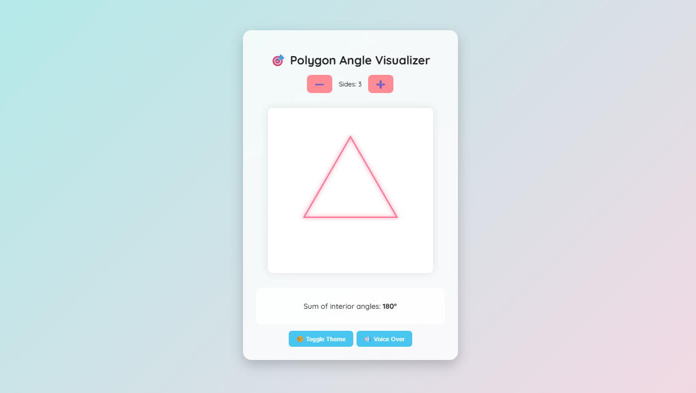

# 🎯 Polygon Angle Visualizer

An interactive and educational  responsive math applet built with **HTML**, **CSS**, and **JavaScript** to help children understand how the **sum of interior angles in a polygon** is calculated using the formula:

Sum = (n - 2) × 180°

---

## 📸 Preview

---

## 🧠 Learning Objective

To visually demonstrate how increasing the number of sides of a polygon increases the total sum of its interior angles. Designed with a child-friendly interface, voiceover support, and theme toggles for accessibility and engagement.

---

## 🔧 Features

- 🔺 Polygon rendering (from triangle to 12-gon)
- 🧮 Real-time formula update: **(n - 2) × 180°**
- 🎨 Light/Dark mode toggle with animated transitions
- 🔊 Voice-over toggle for accessibility (reads the formula aloud)
- 🌀 Smooth canvas animations and glowing polygon effect
- 👶 Friendly UI with playful design and colors

---

## 🛠️ Tech Stack

- **HTML5 Canvas API**
- **CSS3** (Gradients, Animations, Responsive Design)
- **JavaScript** (DOM, SpeechSynthesis, Dynamic Drawing)

---

## 🚀 Getting Started

### 1. Clone the Repository

- git clone https://github.com/Anshika31sharma/AngleExplainer
- cd AngleExplainer

### 2. Open in Browser

Simply open the index.html file in your browser.

## Author

- **Anshika Sharma**